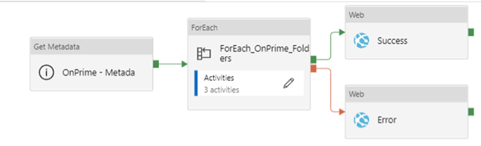

# Migrate onprime files to blob and setup event based trigger 

## Scenario

* Create pipeline in Datafactory to move onprime files to blob
* Configure event based trigger to process multiple files parallelly
* Configure logic app to send email notification

## Solutions

test
